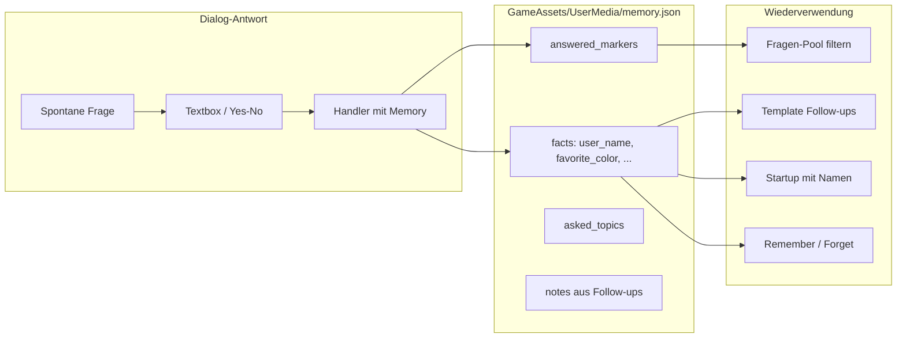

# Dialog-Memory ohne KI

## Kurzantwort

Ja — genau so funktioniert es sinnvoll: Wenn der Nutzer z. B. auf „What should I call you?“ antwortet, wird `user_name` in einer lokalen JSON-Datei gespeichert. Beim nächsten Start begrüßt Kinito mit dem Namen (z. B. „Welcome back, Alex!“), fragt die Name-Frage nicht erneut, und kann den Namen in Follow-ups wie „Hey Alex, got any plans for the weekend?“ einsetzen.

Das ist bereits in der AI-Variante unter [`ai-info/KinitoPet-Desktop-Assistant-AI`](../KinitoPet-Desktop-Assistant-AI) umgesetzt — wir portieren **nur den deterministischen Teil** (ohne Chat-Extraktor und ohne Ollama-Planer).

## Ausgangslage im Haupt-Branch

Heute werden Antworten nur einmal gesprochen und verworfen:

```172:178:content/dialog_registry.py
def _text_format(response_lines) -> Handler:
    """Build a handler that speaks a formatted line with the user's text answer."""

    def handler(app, response: str) -> None:
        app.speak(dlg.pick_line(response_lines).format(response=response))
```

Fragen kommen ungefiltert aus dem Pool:

```30:36:kinito/features/content.py
    def _available_spontaneous_questions(self):
        """Return question pool entries that fit the current app state."""
        pool = list(QUESTIONS)
        if getattr(self, "_camera_active", False):
            marker = dlg.CAMERA_QUESTION_MARKER.lower()
            pool = [q for q in pool if marker not in q.lower()]
        return pool or list(QUESTIONS)
```

## Ziel-Architektur



## Speicherformat

Datei: [`GameAssets/UserMedia/memory.json`](GameAssets/UserMedia/memory.json) (wird automatisch angelegt, nicht ins Git)

```json
{
  "version": 1,
  "facts": {
    "user_name": "Alex",
    "favorite_color": "blau"
  },
  "answered_markers": ["What should I call you?", "What's your favorite color?"],
  "asked_topics": ["weekend_plans"],
  "notes": [
    {"text": "weekend_plans: hiking (Alex, got any plans...)", "source": "question", "created": "2026-07-13"}
  ]
}
```

- **`facts`**: strukturierte Antworten aus den 13 persönlichen Dialogfragen (Name, Farbe, Essen, Hobby, Haustier, Buch, Getränk, Film, Snack, Jahreszeit, Programmieren/Musik/Kaffee ja/nein)
- **`answered_markers`**: verhindert Wiederholung der Basis-Fragen
- **`asked_topics`**: verhindert Wiederholung von Follow-up-Fragen
- **`notes`**: Antworten auf Follow-ups, die keinem Fact-Key zugeordnet sind

Referenz-Implementierung: [`KinitoPet-Desktop-Assistant-AI/kinito/memory/store.py`](../KinitoPet-Desktop-Assistant-AI/kinito/memory/store.py)

## Implementierung (in 5 Schritten)

### 1. MemoryStore + Schlüssel-Mapping

**Neu portieren** (nahezu 1:1 aus AI-Variante):

| Datei | Zweck |
|-------|-------|
| [`kinito/memory/store.py`](kinito/memory/store.py) | Laden/Speichern, `set_fact`, `mark_answered`, `is_question_answered`, `as_spoken_summary`, atomisches Schreiben |
| [`kinito/memory/questions.py`](kinito/memory/questions.py) | `MemoryQuestion`-Dataclass |
| [`kinito/memory/validation.py`](kinito/memory/validation.py) | Nur für Follow-up-Notizen (`source="question"` → immer speichern) |
| [`content/memory_keys.py`](content/memory_keys.py) | Mapping Marker → Fact-Key (13 persönliche Fragen) |

**Init** in [`kinito/app.py`](kinito/app.py): `MemoryMixin` einbinden, `_init_memory()` in `__init__` aufrufen.

### 2. Dialog-Antworten persistieren

In [`content/dialog_registry.py`](content/dialog_registry.py):

- `_persist_dialog_answer(app, marker, fact_key, value)` hinzufügen
- `_text_format_with_memory(marker, key, lines)` und `_yes_no_lines_with_memory(marker, key, yes_lines, no_lines)` hinzufügen
- Bestehende Handler für persönliche Fragen umstellen (z. B. `NAME_QUESTION` → `user_name`, `COLOR_QUESTION` → `favorite_color`, …)

Beispiel aus AI-Variante:

```python
def _text_format_with_memory(marker, fact_key, response_lines):
    def handler(app, response):
        _persist_dialog_answer(app, marker, fact_key, response)
        app.speak(dlg.pick_line(response_lines).format(response=response))
    return handler
```

### 3. Fragen filtern + Follow-ups (A + C)

In [`kinito/features/content.py`](kinito/features/content.py):

- `_available_spontaneous_questions()`: beantwortete Marker aus dem Pool entfernen
- `speak_random_question()`: mit ~25 % Chance zuerst ein Template-Follow-up versuchen, wenn schon Fakten existieren

**Neu:** [`content/memory_followups.py`](content/memory_followups.py) mit `pick_template_followup(memory)` — portiert aus AI-Variante, z. B.:

- Kennt `user_name` → „{user_name}, got any plans for the weekend?“
- Kennt `favorite_food` → „Do you cook {favorite_food} yourself?“ (Yes/No)
- Kennt `hobby` → „How long have you been into {hobby}?“

**Neu:** [`kinito/features/memory.py`](kinito/features/memory.py) mit `MemoryMixin`:

- `show_memory_summary()` / `forget_memory()`
- `ask_memory_question(spec)` / `_handle_memory_question_response()`

**Speech-Anpassungen** in [`kinito/speech.py`](kinito/speech.py) (wie in AI-Variante):

- Bei `_pending_memory_question`: Textbox oder Yes/No-Buttons an die Bubble hängen
- `handle_response()`: Memory-Follow-ups separat routen (nicht über `find_dialog_spec`)

### 4. Persönliche Startup-Begrüßung

Wenn `user_name` in `memory.json` bekannt ist, verwendet Kinito beim Start den Namen in der Begrüßung.

**In** [`content/startup.py`](content/startup.py):

- Neues Tuple `STARTUP_LINES_WITH_NAME` mit `{user_name}`-Platzhalter, z. B.:
  - `"Welcome back, {user_name}! I kept your spot warm on the desktop."`
  - `"Hey {user_name}! Ready to hang out again?"`
  - `"Look who showed up! {user_name}, my favorite human on this desktop."`
- Bestehende `STARTUP_LINES` bleiben als Fallback, wenn noch kein Name gespeichert ist

**In** [`kinito/app.py`](kinito/app.py) → `_play_startup_line()`:

```python
name = getattr(self, "_memory", None) and self._memory.get_fact("user_name")
if name:
    line = random.choice(STARTUP_LINES_WITH_NAME).format(user_name=name)
else:
    line = random.choice(STARTUP_LINES)
self.speak(line)
```

**Verhalten:** Erster Start ohne Name → generische Begrüßung wie bisher. Sobald der Nutzer seinen Namen genannt hat → ab dem nächsten Start personalisierte Zeile. Nach „Forget everything“ → wieder generisch.

**Test:** Startup-Test — mit gesetztem `user_name` in MemoryStore wird eine formatierte Zeile gewählt.

### 5. UX, Doku, Tests

**Menü** in [`content/dialog_registry.py`](content/dialog_registry.py) + [`content/dialogue.py`](content/dialogue.py):

- `BUTTON_REMEMBER = "What do you remember?"`
- `BUTTON_FORGET = "Forget everything"`
- `MEMORY_EMPTY_LINE`, `MEMORY_FORGOTTEN_LINE`, `MEMORY_ANSWER_ACK_LINES`

**Git/Doku:**

- [`.gitignore`](.gitignore): `GameAssets/UserMedia/memory.json`, `notes.txt`
- [`GameAssets/UserMedia/README.txt`](GameAssets/UserMedia/README.txt) + [`README.md`](README.md): Memory-Abschnitt (ohne Ollama-Hinweise)

**Tests** (aus AI-Variante adaptieren):

- `tests/test_memory_store.py` — Roundtrip, Marker-Filter, Reset
- `tests/test_memory_questions.py` — Dialog-Handler speichert Fakten
- `tests/test_memory_followups.py` — Template-Auswahl basierend auf Fakten
- `tests/test_content_mixin.py` — Fragen-Pool-Filter + Follow-up-Pfad
- Startup-Test — personalisierte Zeile bei bekanntem `user_name`

## Was bewusst nicht dazugehört

- `MemoryExtractor` / Chat-Notizen per KI
- `MemoryQuestionPlanner` / Ollama
- LLM-Prompt-Injection

## Erwartetes Nutzerverhalten nach Umsetzung

1. Kinito fragt spontan nach dem Namen → Nutzer tippt „Alex“
2. Kinito antwortet wie bisher („Nice to meet you, Alex!“) **und** speichert `user_name`
3. Nach Neustart: personalisierte Begrüßung (z. B. „Welcome back, Alex!“) statt generischer Zeile
4. Name-Frage erscheint nicht mehr im Idle-Pool
5. Später evtl. Follow-up: „Alex, got any plans for the weekend?“
6. Rechtsklick → „What do you remember?“ liest gespeicherte Fakten vor
7. Rechtsklick → „Forget everything“ löscht alles (inkl. personalisierter Begrüßung)

## Risiken / Hinweise

- **Manuelles Editieren** von `memory.json` ist möglich (User-Ordner); kaputte JSON wird beim Laden still ignoriert und neu gestartet
- **Stimmungsfragen** (bored, lonely, day) bleiben im Pool — nur persönliche Fakten werden „einmal fragen“
- **Kein Chat** in diesem Branch → Notes kommen nur aus Follow-up-Antworten, nicht aus Freitext-Chat
